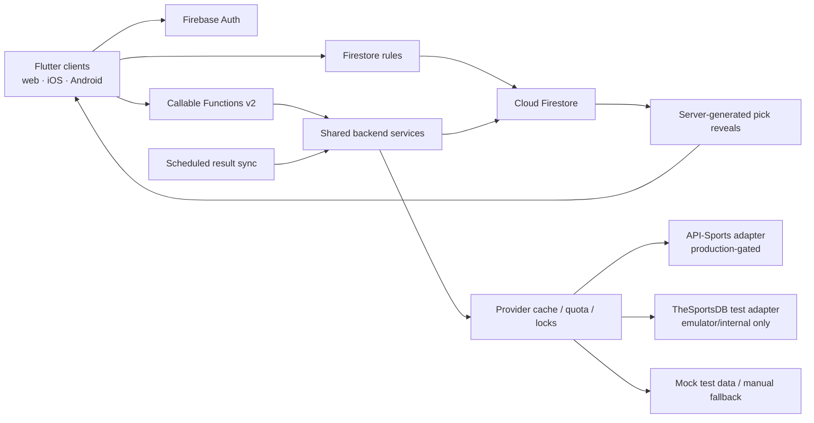

# Architecture

## System boundary

## Flutter

- `lib/app`: bootstrap, router, theme, responsive shell
- `lib/core`: time, scoring, errors, Firebase boundary, responsive primitives
- `lib/data`: typed domain models and repositories
- `lib/features`: vertical feature screens and presentation state

Widgets do not call a sports provider. Repository providers own data access and
functions own privileged mutations. A pure `ScoringEngine` makes domain behavior
repeatable in Flutter tests and mirrors server recomputation.

Connected and demo controllers must remain separate. A normal build initializes
only the authorized `lukes-picks` options; demo mode is explicit, and emulator
mode requires `demo-lukes-picks-local`. Configuration failure is a visible
retry state, never a demo fallback.

Catalog candidates and selected week games are separate state domains. The
catalog is query/filter/cache state; selected games are the exact server draft
or published snapshots. A week subscription cannot overwrite the catalog.

The Flutter and Functions layers passed the isolated three-user
browser-to-emulator release test together. See
[validation-report.md](validation-report.md) for dated evidence.

## Backend

Functions use Firebase Admin, strict TypeScript, schema validation, authenticated
role checks, request IDs, structured logs, and conservative v2 scaling.
Mutations use transactions or bounded chunks according to the operation.
Provider reads are cache-first and guarded by a distributed lock, quota
headroom, timeout, backoff, and circuit breaker. Recovery and concurrency paths
still require production-scale load and fault-injection validation.

Provider mode is server-authoritative. Production remains manual until a
production provider passes its gate. Mock and TheSportsDB test modes must fail
closed in `lukes-picks`.

Finalization reads the entire authoritative week, recomputes entries, writes
ranked snapshots, rebuilds aggregate standings, records an audit event, and
advances the rotation in an idempotent transaction/versioned operation.

## Privacy boundary

Pre-lock team selections live only below
`entries/{uid}/picks/{gameId}`. Other members and commissioners do not receive a
client-side bypass. After lock, trusted backend code copies only reveal-safe
fields to `reveals/{gameId}/picks/{uid}`. Email remains in private
`users/{uid}` and never appears in league membership documents.

## Resilience

- Manual data permits production operation without a provider key. Mock data is
  emulator/test-only.
- Final normalized games are cached indefinitely until a requested correction.
- Content hashes suppress unchanged writes.
- Result and outcome versions make retries no-ops.
- Full standings rebuild is a recovery action.
- The default Firebase alias remains emulator-only, while production writes
  require the guarded explicit project wrapper.
