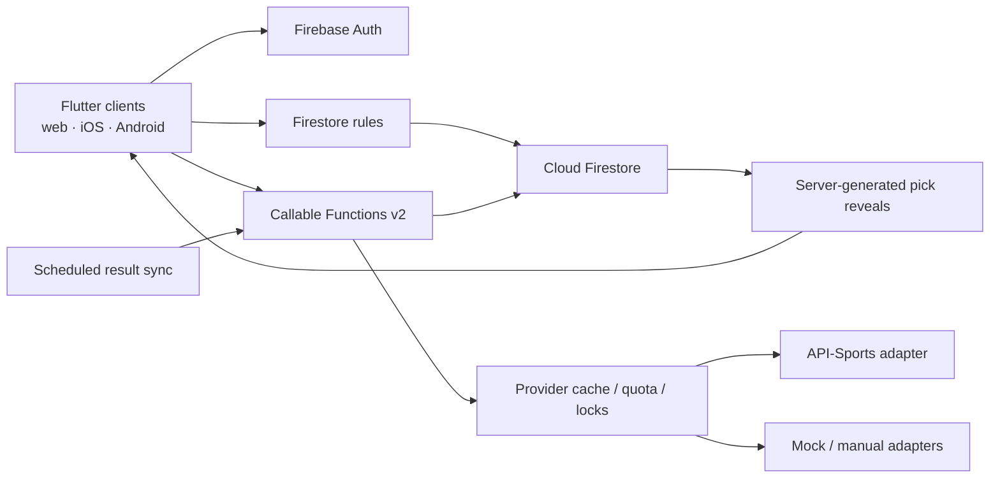

# Architecture

## System boundary

## Flutter

- `lib/app`: bootstrap, router, theme, responsive shell
- `lib/core`: time, scoring, errors, Firebase boundary, responsive primitives
- `lib/data`: typed domain models and repositories
- `lib/features`: vertical feature screens and presentation state

Widgets do not call a sports provider. Repository providers own data access and
functions own privileged mutations. A pure `ScoringEngine` makes domain behavior
repeatable in Flutter tests and mirrors server recomputation.

The target boundary above is implemented for the core collections and
operations. The client restores membership and subscribes to league, week,
games, entries, picks, reveals, standings, members, and finalized history.
However, the Flutter and Functions layers have separate automated evidence; a
full browser-to-emulator or live-cloud end-to-end test has not been run. Some
administrative callables, including explicit next-week creation/assignment, are
not yet surfaced in the client. See
[validation-report.md](validation-report.md).

## Backend

Functions use Firebase Admin, strict TypeScript, schema validation, authenticated
role checks, request IDs, structured logs, and conservative v2 scaling.
Mutations use transactions or bounded chunks according to the operation.
Provider reads are cache-first and guarded by a distributed lock, quota
headroom, timeout, backoff, and circuit breaker. Recovery and concurrency paths
still require production-scale load and fault-injection validation.

Finalization reads the entire authoritative week, recomputes entries, writes
ranked snapshots, rebuilds aggregate standings, records an audit event, and
advances the rotation in an idempotent transaction/versioned operation.

## Privacy boundary

Pre-lock team selections live only below
`entries/{uid}/picks/{gameId}`. Other members and commissioners do not receive a
client-side bypass. After lock, trusted backend code copies only reveal-safe
fields to `reveals/{gameId}/picks/{uid}`. Email remains in private
`users/{uid}` and never appears in league membership documents.

## Resilience

- Mock/manual data permits backend operation during provider outage or quota
  exhaustion; complete connected Flutter UI coverage is still pending.
- Final normalized games are cached indefinitely until a requested correction.
- Content hashes suppress unchanged writes.
- Result and outcome versions make retries no-ops.
- Full standings rebuild is a recovery action.
- Emulator-only mode is the default until a cloud project is explicitly chosen.
