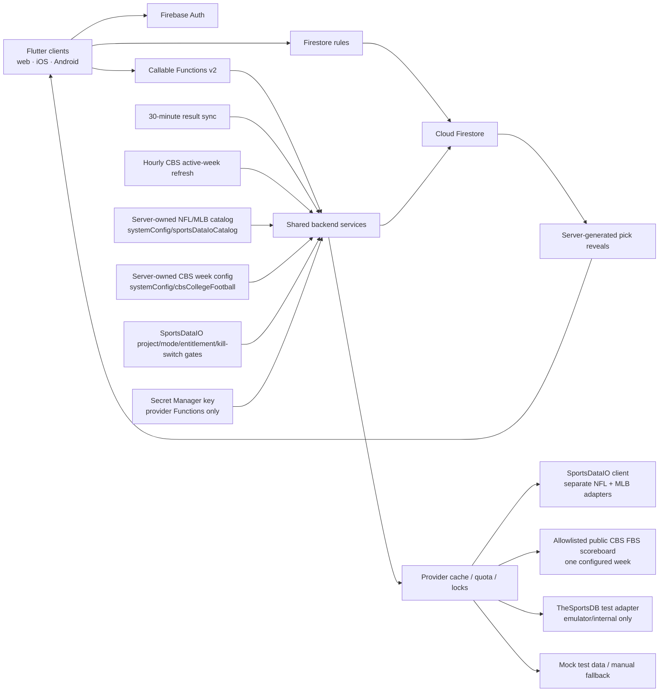

# Architecture

## System boundary

## Flutter

- `lib/app`: bootstrap, router, theme, responsive shell
- `lib/core`: time, scoring, errors, Firebase boundary, responsive primitives
- `lib/data`: typed domain models and repositories
- `lib/features`: vertical feature screens and presentation state

Widgets do not call a sports provider. Repository providers own data access and
functions own privileged mutations. A pure `ScoringEngine` makes domain behavior
repeatable in Flutter tests and mirrors server recomputation.

Connected and demo controllers must remain separate. A normal build initializes
only the authorized `lukes-picks` options; demo mode is explicit, and emulator
mode requires `demo-lukes-picks-local`. Configuration failure is a visible
retry state, never a demo fallback.

Catalog candidates and selected week games are separate state domains. The
controller uses four distinct containers: the current query results, a
cross-query canonical game cache, the desired draft selection map, and the
authoritative week-game stream. The persisted server draft IDs form a fifth,
ID-only reconciliation baseline. A new query replaces only current results;
it can refresh a selected object's canonical fields but cannot discard a
selection from another sport, league, or date. A week subscription cannot
overwrite the catalog.

`listSportsCatalog` has a typed discovery contract. An initial request can omit
the provider query, and the server returns enabled sports and leagues,
canonical provider league IDs and seasons, presentation policy, availability,
cache metadata, active-week bounds, games, and the effective query. Subsequent
UI filter changes issue new callable requests using those server-returned
identities. Date windows are arena-local calendar dates, constrained to the
active week and seven inclusive days in both the client and server.

Arena provider selection is backward compatible and per sport:
`settings.providerName` is the default, and `settings.providerBySport` overrides
only named sports. Mapping `NCAAF` to `cbsSports` therefore does not reroute an
arena's NFL, MLB, or manual catalog.

The deployed dormant-provider Flutter and Functions layers passed the isolated
three-user browser-to-emulator release test together. See
[validation-report.md](validation-report.md) for dated evidence.

## Backend

Functions use Firebase Admin, strict TypeScript, schema validation, authenticated
role checks, request IDs, structured logs, and conservative v2 scaling.
Mutations use transactions or bounded chunks according to the operation.
Provider reads are cache-first and guarded by a distributed lock, quota
headroom, timeout, backoff, and circuit breaker. Recovery and concurrency paths
still require production-scale load and fault-injection validation.

Provider mode is server-authoritative. Production remains manual until a
production provider passes its gate. Mock and TheSportsDB test modes must fail
closed in `lukes-picks`.

The SportsDataIO path has independent, fail-closed project, emulator, deploy
kill-switch, environment access-mode, environment entitlement, server-catalog,
per-league feed, and Secret Manager key gates. Only `production` mode can run
the production adapter; fixture/trial/discovery modes remain test or delayed-
access classifications. No secret or contract document belongs in Firestore.

The provider factory reads `systemConfig/sportsDataIoCatalog` with Admin SDK
access; rules deny every client read/write. The callable re-resolves query
metadata against the configured NFL/MLB seasons and enforces US Eastern date
buckets. The dedicated client constructs only five exact HTTPS League API path
families and authenticates by header. Flutter never receives a vendor URL, key,
or raw schema.

The separate `cbsSports` adapter reads
`systemConfig/cbsCollegeFootball` through the Admin SDK and supports only the
`NCAAF` / `ncaaf` / `FBS` identity. It constructs a single HTTPS CBS scoreboard
route from validated season, season type, and week fields; neither Flutter nor
Firestore supplies an arbitrary URL. Redirects must resolve to that exact route,
and the page canonical/`og:url` or title must confirm the same season, type, week,
and FBS identity. The same response's inert base64 `reduxPreloadedState` may
enrich a visible card only after its page identity, numeric game ID, game
abbreviation, CBS week metadata, Eastern display time, and UTC epoch all agree;
the script is decoded but never evaluated. Normalized week data, refresh lease,
conditional-request metadata, and per-page safe failure state live in the private
`sportsProviderCache` document. The provider-global rolling-24-hour attempt
ledger, failure counter, and circuit deadline live at
`providerUsage/cbsSports_rolling24h`. Raw HTML is parsed in memory and is not
persisted.

Production evidence recorded on 2026-08-27 confirms this boundary is active
for FBS 2026 regular-season Week 1 under parser 1.2.0. A single permitted
post-cooldown request produced 99 normalized games with 99 UTC kickoffs, 99
effective lock instants, and zero TBD games. The authenticated live UI restored
its session and rendered the completed entry with timed, disabled choices; no
published slate or pick was mutated during verification.

Only the configured active identity can make a network request. The server and
Flutter advertise exactly that season, season type, and week; they do not expose
a synthetic historical range. Parser-version changes force a full
unconditional reparse, and zero-game or unexplained smaller parses retain the
last known good normalized schedule.

Separate NFL and MLB adapters map endpoint-specific DTOs into
`NormalizedGame`. NFL joins `SchedulesBasic` identity/reschedule data with
`ScoresByDate`; MLB uses `GamesByDate` so exception statuses remain observable.
Stable cross-reference IDs support result reconciliation without using
matchup/date identity. True time-TBD games remain catalog-only until a UTC start
exists. Every closed result is checked for scores and ties before grading.

Provider-facing Functions retain the existing stable application contract:

- `listSportsCatalog` resolves the centralized allowlist and returns normalized,
  cache-aware schedule data to the authorized picker/admin;
- `saveDraftSlate` and `publishWeeklySlate` validate canonical cached games,
  reject duplicates/empty publication, and atomically expose snapshots;
- `refreshSelectedGames` is an admin refresh path with server throttling;
- `syncSelectedGameResults` is the protected on-demand reconciliation path;
- `getCollegeFootballSchedule` returns one normalized CBS FBS week to the
  authenticated current picker or an arena owner/commissioner through the same
  cache coordinator;
- `refreshCollegeFootballScheduleAdmin` permits a reasoned, authorized
  picker/admin refresh while retaining the production cooldown and request cap;
- `refreshActiveCollegeFootballSchedule` runs hourly with retries disabled and
  evaluates only the configured active week; it is a no-op when CBS or automatic
  refresh is disabled;
- `scheduledResultSync` runs every 30 minutes UTC, claims shared provider work,
  refreshes active selected games, reveals newly locked picks, and invokes the
  existing idempotent result/standings lifecycle; and
- `overrideGameResult`, `voidGame`, `finalizeWeek`, and `rebuildStandings`
  remain audited administrator recovery paths. Provider downtime never removes
  the manual-game/result fallback.

Publication also snapshots the selected games' connected provider and its
reviewed presentation policy onto the week document. Picks and Results obtain
that server-authored, member-readable policy from the week stream; ordinary
members never need access to the picker-only catalog callable. Draft catalog
responses remain authoritative for the picker, and a missing, mismatched, or
legacy week snapshot remains logo-disabled.

When the active week changes through another connected client, the controller
invalidates in-flight catalog work and clears every week-scoped draft, pick,
entry, and result view before subscribing to the new week. Publication also
invalidates draft catalog requests so a late response cannot replace the
immutable presentation snapshot. Week subscriptions use generation ownership so
rapid consecutive transitions cannot reinstall an older listener, and draft
save/publish actions validate their captured week after every network boundary.
Server publish retries treat every recognized post-publication week status as
the same already-published slate, including final settlement of concurrent calls
sharing one request ID.

The bounded 2026-08-27 CBS Week 1 observation contained 99 mutually consistent
preloaded kickoff epochs/display times, including all eight August 29 games.
Deterministic fixtures still own routine parser, normalization, transport, and
workflow validation; local tests never contact CBS, and source evidence alone
does not prove a particular cloud deployment.

Finalization reads the entire authoritative week, recomputes entries, writes
ranked snapshots, rebuilds aggregate standings, records an audit event, and
advances the rotation in an idempotent transaction/versioned operation.
Next-week creation waits for that per-week rotation marker and derives the picker
from it; a stale client-supplied picker cannot override the finalized rotation.
A finalized-only follow-up claim coordinates standings/rotation repair with
reopen, and never re-finalizes a correction in progress. Before next-week
creation, the same transactionally guarded rotation path replaces an inactive
recorded next picker with the next active member. League-wide standings epochs
fence every rebuild chunk and force a fresh aggregate read when a different
week finalizes or reopens concurrently.

## Privacy boundary

Pre-lock team selections live only below
`entries/{uid}/picks/{gameId}`. Other members and commissioners do not receive a
client-side bypass. After lock, trusted backend code copies only reveal-safe
fields to `reveals/{gameId}/picks/{uid}`. Email remains in private
`users/{uid}` and never appears in league membership documents.

Arena admission uses owner-only callable Functions. The server stores only an
HMAC lookup and bounded invite metadata; Flutter receives the raw bearer code
only in the issuance response. Shared web links carry it in a URL fragment,
survive the authentication/restoration redirects, require an explicit Join
action, and are scrubbed from the route after success. Native and mobile-web
clients use the platform share sheet so Messages can be selected without
collecting phone numbers or requesting SMS permissions.

## Resilience

- Manual data permits production operation while SportsDataIO is inactive.
  Mock data is emulator/test-only.
- Catalog cache identities include canonical provider metadata, date bounds,
  and timezone so arena-local queries cannot collide.
- CBS is the exception by design: its canonical cache identity is one FBS
  season/season-type/week page, and arena-date filtering happens only after the
  shared weekly cache is read.
- Provider presentation defaults to neutral initials. Remote URLs survive
  normalization and Flutter rendering only after a reviewed date and exact
  host/query policy pass independently at both layers.
- Published weeks retain their publish-time presentation snapshot rather than
  inheriting later mutable catalog policy. Revoking a previously approved logo
  policy therefore requires a trusted update/backfill of affected open or
  historical week snapshots.
- Final catalog responses use a long-lived cache, while selected terminal-game
  refreshes use a finite cache so later provider corrections remain observable.
- Empty schedule responses cache for two hours for other providers and 30
  minutes for SportsDataIO. SportsDataIO live games cache for 10 minutes; games starting within two hours for 15 minutes; games two to 24 hours
  out for 30 minutes; farther games for one hour; and unresolved anomaly states
  for one hour. Terminal catalog data is retained long-term, while selected
  terminal games reconcile after 12 hours. Stale cached data may be returned
  with an explicit indicator after a bounded refresh failure.
- Content hashes suppress unchanged game payload writes; canonical trust-window
  metadata can still advance on a provider refresh.
- Result and outcome versions make retries no-ops.
- Full standings rebuild is a recovery action.
- The default Firebase alias remains emulator-only, while production writes
  require the guarded explicit project wrapper.
