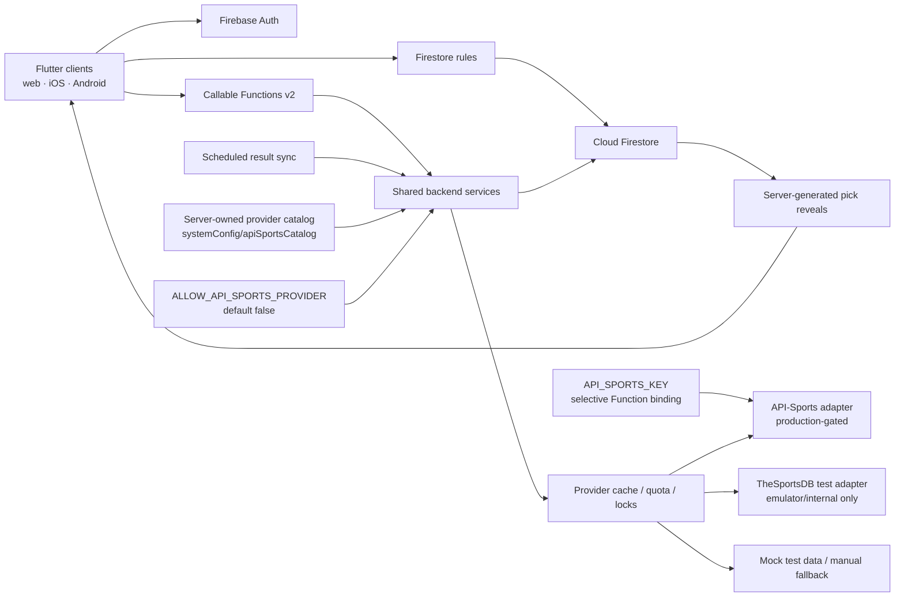

# Architecture

## System boundary

## Flutter

- `lib/app`: bootstrap, router, theme, responsive shell
- `lib/core`: time, scoring, errors, Firebase boundary, responsive primitives
- `lib/data`: typed domain models and repositories
- `lib/features`: vertical feature screens and presentation state

Widgets do not call a sports provider. Repository providers own data access and
functions own privileged mutations. A pure `ScoringEngine` makes domain behavior
repeatable in Flutter tests and mirrors server recomputation.

Connected and demo controllers must remain separate. A normal build initializes
only the authorized `lukes-picks` options; demo mode is explicit, and emulator
mode requires `demo-lukes-picks-local`. Configuration failure is a visible
retry state, never a demo fallback.

Catalog candidates and selected week games are separate state domains. The
controller uses four distinct containers: the current query results, a
cross-query canonical game cache, the desired draft selection map, and the
authoritative week-game stream. The persisted server draft IDs form a fifth,
ID-only reconciliation baseline. A new query replaces only current results;
it can refresh a selected object's canonical fields but cannot discard a
selection from another sport, league, or date. A week subscription cannot
overwrite the catalog.

`listSportsCatalog` has a typed discovery contract. An initial request can omit
the provider query, and the server returns enabled sports and leagues,
canonical provider league IDs and seasons, presentation policy, availability,
cache metadata, active-week bounds, games, and the effective query. Subsequent
UI filter changes issue new callable requests using those server-returned
identities. Date windows are arena-local calendar dates, constrained to the
active week and seven inclusive days in both the client and server.

The previously deployed manual-provider Flutter and Functions layers passed the
isolated three-user browser-to-emulator release test together. See
[validation-report.md](validation-report.md) for dated evidence.

## Backend

Functions use Firebase Admin, strict TypeScript, schema validation, authenticated
role checks, request IDs, structured logs, and conservative v2 scaling.
Mutations use transactions or bounded chunks according to the operation.
Provider reads are cache-first and guarded by a distributed lock, quota
headroom, timeout, backoff, and circuit breaker. Recovery and concurrency paths
still require production-scale load and fault-injection validation.

Provider mode is server-authoritative. Production remains manual until a
production provider passes its gate. Mock and TheSportsDB test modes must fail
closed in `lukes-picks`.

API-Sports configuration has three independent server-side gates:

1. `API_SPORTS_KEY` is a Secret Manager parameter bound only to the catalog,
   selected-game refresh/sync, and scheduled result-sync Functions.
2. `ALLOW_API_SPORTS_PROVIDER` is a deploy-time boolean that defaults to
   `false` and is accepted only for the non-emulator `lukes-picks` runtime.
3. `systemConfig/apiSportsCatalog` supplies validated product hosts, league
   IDs, seasons, paths, final-status mappings, and presentation policy.

The provider factory reads that document with Admin SDK access; Firestore rules
deny every client read/write. The callable re-resolves client query metadata
against the discovered catalog and substitutes the arena's stored timezone.
Stored `providerLeagueId` and `season` values let result refresh reconstruct an
unambiguous provider query later.

Publication also snapshots the selected games' connected provider and its
reviewed presentation policy onto the week document. Picks and Results obtain
that server-authored, member-readable policy from the week stream; ordinary
members never need access to the picker-only catalog callable. Draft catalog
responses remain authoritative for the picker, and a missing, mismatched, or
legacy week snapshot remains logo-disabled.

When the active week changes through another connected client, the controller
invalidates in-flight catalog work and clears every week-scoped draft, pick,
entry, and result view before subscribing to the new week. Publication also
invalidates draft catalog requests so a late response cannot replace the
immutable presentation snapshot. Week subscriptions use generation ownership so
rapid consecutive transitions cannot reinstall an older listener, and draft
save/publish actions validate their captured week after every network boundary.
Server publish retries treat every recognized post-publication week status as
the same already-published slate, including final settlement of concurrent calls
sharing one request ID.

The source candidate declares these gates, but no approved
`API_SPORTS_KEY` currently exists and no production provider-backed release is
claimed. The deployed site remains manual-provider. Sanitized fixtures prove
only parser/normalization behavior; they are not production configuration.

Finalization reads the entire authoritative week, recomputes entries, writes
ranked snapshots, rebuilds aggregate standings, records an audit event, and
advances the rotation in an idempotent transaction/versioned operation.
Next-week creation waits for that per-week rotation marker and derives the picker
from it; a stale client-supplied picker cannot override the finalized rotation.
A finalized-only follow-up claim coordinates standings/rotation repair with
reopen, and never re-finalizes a correction in progress. Before next-week
creation, the same transactionally guarded rotation path replaces an inactive
recorded next picker with the next active member. League-wide standings epochs
fence every rebuild chunk and force a fresh aggregate read when a different
week finalizes or reopens concurrently.

## Privacy boundary

Pre-lock team selections live only below
`entries/{uid}/picks/{gameId}`. Other members and commissioners do not receive a
client-side bypass. After lock, trusted backend code copies only reveal-safe
fields to `reveals/{gameId}/picks/{uid}`. Email remains in private
`users/{uid}` and never appears in league membership documents.

## Resilience

- Manual data permits production operation without a provider key. Mock data is
  emulator/test-only.
- Catalog cache identities include canonical provider metadata, date bounds,
  and timezone so arena-local queries cannot collide.
- Provider presentation defaults to neutral initials. Remote URLs survive
  normalization and Flutter rendering only after a reviewed date and exact
  host/query policy pass independently at both layers.
- Published weeks retain their publish-time presentation snapshot rather than
  inheriting later mutable catalog policy. Revoking a previously approved logo
  policy therefore requires a trusted update/backfill of affected open or
  historical week snapshots.
- Final catalog responses use a long-lived cache, while selected terminal-game
  refreshes use a finite cache so later provider corrections remain observable.
- Content hashes suppress unchanged game payload writes; canonical trust-window
  metadata can still advance on a provider refresh.
- Result and outcome versions make retries no-ops.
- Full standings rebuild is a recovery action.
- The default Firebase alias remains emulator-only, while production writes
  require the guarded explicit project wrapper.
